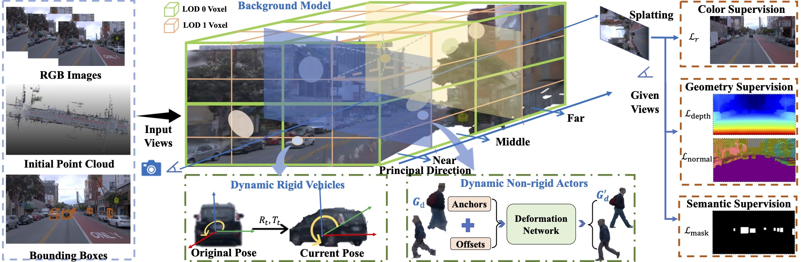

## DriveSplat: Decoupled Dynamic Scenario Representation with Partitioned Neural Gaussians for Driving Scene Reconstruction

# 📖 Overview
We introduce DriveSplat, a high-quality reconstruction method for driving scenarios based on neural Gaussian representations with dynamic-static decoupling. To better accommodate the predominantly linear motion patterns of driving viewpoints, a region-wise voxel initialization scheme is employed, which partitions the scene into near, middle, and far regions to enhance close-range detail representation. Deformable neural Gaussians are introduced to model non-rigid dynamic actors such as pedestrians and cyclists, whose parameters are temporally adjusted by a learnable deformation network. The entire framework is further supervised by depth and normal priors from pre-trained models, improving the accuracy of geometric structures. 

# 👀 Demo

https://github.com/Michael-Evans-Savitar/DriveSplat/assets/006.mp4

https://github.com/Michael-Evans-Savitar/DriveSplat/blob/main/assets/006.mp4

    

        <video width="100%" controls>
            <source src="https://github.com/Michael-Evans-Savitar/DriveSplat/blob/main/assets/006.mp4" type="video/mp4">
        </video>
        
Scene 006

    

    

        <video width="100%" controls>
            <source src="https://github.com/Michael-Evans-Savitar/DriveSplat/blob/main/assets/006.mp4" type="video/mp4">
            您的浏览器不支持视频标签
        </video>
        
Scene 006

    

    

        <video width="100%" controls>
            <source src="assets/026.mp4" type="video/mp4">
            您的浏览器不支持视频标签
        </video>
        
Scene 026

    

    

        <video width="100%" controls>
            <source src="assets/090.mp4" type="video/mp4">
            您的浏览器不支持视频标签
        </video>
        
Scene 090

    

    

        <video width="100%" controls>
            <source src="assets/105.mp4" type="video/mp4">
            您的浏览器不支持视频标签
        </video>
        
Scene 105

    

    

        <video width="100%" controls>
            <source src="assets/108.mp4" type="video/mp4">
            您的浏览器不支持视频标签
        </video>
        
Scene 108

    

    

        <video width="100%" controls>
            <source src="assets/134.mp4" type="video/mp4">
            您的浏览器不支持视频标签
        </video>
        
Scene 134

    

    

        <video width="100%" controls>
            <source src="assets/150.mp4" type="video/mp4">
            您的浏览器不支持视频标签
        </video>
        
Scene 150

    

    

        <video width="100%" controls>
            <source src="assets/181.mp4" type="video/mp4">
            您的浏览器不支持视频标签
        </video>
        
Scene 181

    

